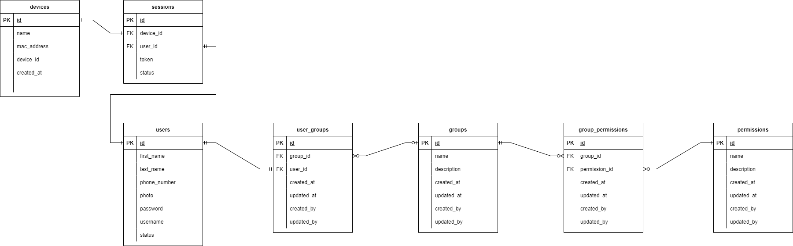

# My-tex project

### Project status
[](https://sonarcloud.io/summary/new_code?id=mytexuz_mytex)
[](https://sonarcloud.io/summary/new_code?id=mytexuz_mytex)
[](https://sonarcloud.io/summary/new_code?id=mytexuz_mytex)
[](https://sonarcloud.io/summary/new_code?id=mytexuz_mytex)

### Used technological stack


## Table of Contents

- [Introduction](#introduction)
- [How to build & How to run](#how-to-build--how-to-run)
- [Dependencies](#dependencies)
- [Diagrams](#diagrams)
- [API](#api)

## Introduction

Backend application for internal automation of the textiles

## How to build & How to run

```shell script
$ mvn clean install
```

```shell script
$ java -jar my-tex.jar --spring.profiles.active=dev
```

## Dependencies

There are not any third party integrations yet...

## Diagrams



## API

### Endpoints

<details>
<summary>ENDPOINTS</summary>

### Card To Card

**Method:** POST<br>
**URI:** /v1/samples/sample<br>
**Request body:**<br>
```
{
    "field1": "<value1:String>",
    "field2": "<value2:String>",
    "field3": "<value3:Decimal>",
    "field4": "<value4:String>"
}
```
**Response body:**<br>
```
{
    "response": "<sampleResponse:String>"
}
```
```SAMPLE_ENUM```: UZ, USD

</details>

### Error codes

Error code                                  | Description         | Status code
-----------                                 |---------------------| ------------- 
user.not.found                              | User does not exist | 404
